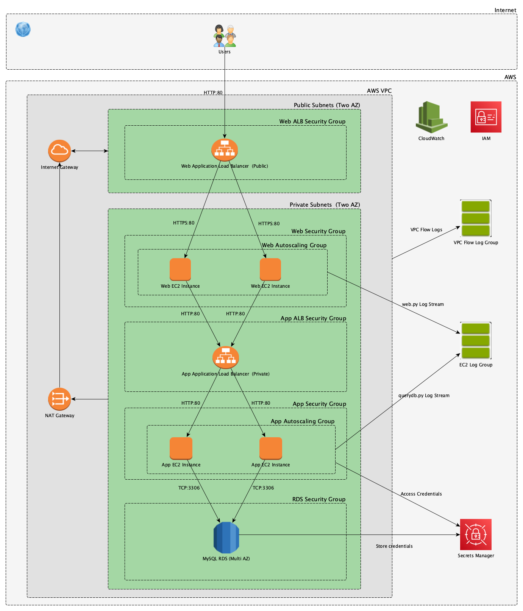

# CDK-3TA
CDK example on how to build a Web 3 Tier Architecture.
It is an example for training purpose DON'T USE IT IN PRODUCTION.
Project's location: https://github.com/rluberti/CDK-3TA/

# Introduction

The AWS Cloud Development Kit (AWS CDK) is an open source software development framework to define your cloud application resources using familiar programming languages (see https://aws.amazon.com/cdk/).
This project is a basic example in Python on how to create a classic Web 3 Tier Architecture (Web / App / DB Tiers, see https://en.wikipedia.org/wiki/Multitier_architecture#Three-tier_architecture).

# Features

- Internet public open entrypoint is handled by an Application Load Balancer
- Web/App/DB tiers are on PRIVATE subnets with traffic to internet limited to OUTBOUND only
- Web and App tiers are in autoscaling (min 2 instances to max 4) based on CPU % usage (target is 40%)
- DB tier is a RDS MySQL in multi AZ (see https://aws.amazon.com/rds/mysql/)
- Architecture is contained in one VPC and it is in High Availability using two Availability Zones (AZ)
- Admin access to EC2 instances is only allowed via Session Manager Session. No open inbound ports and no need to manage bastion hosts or SSH keys (see https://docs.aws.amazon.com/systems-manager/latest/userguide/session-manager.html)
- Application logic is provided by some simple code in Pythoin using Flask (see https://flask.palletsprojects.com/en/2.0.x/)
- RDS connectivity credentials and URL path stored using AWS Secret Manager (https://aws.amazon.com/secrets-manager/)
- Web and App applications are streaming their custom logs using "Log streams" created in the "CDK-3TA-EC2-LOG-GROUP" Log group on CloudWatch console page.
- VPC is logging internal network activity via "Flow log" created in "CDK-3TA-VPC-FLOWLOG-GROUP" Log group (see https://docs.aws.amazon.com/vpc/latest/userguide/flow-logs.html).

# Installation

## Requirements
- AWS CLI (see https://docs.aws.amazon.com/cli/latest/userguide/install-cliv2-mac.html) or just use AWS Cloud Shell (see https://aws.amazon.com/cloudshell/)
- CDK (see https://docs.aws.amazon.com/cdk/latest/guide/cli.html)
- Python 3.x 
- git
## Steps
- Clone repository
- `git clone https://github.com/rluberti/CDK-3TA.git`
- Create Python Virtual Environment
- `cd CDK-3TA`
- `python3 -m venv .venv`
- Run Virtual Environment
- `source .venv/bin/activate`
- Install Python packages
- `pip3 install aws-cdk.aws-codedeploy aws-cdk.aws-rds`
- Check if CDK can create CloudFormation code running:
- `cdk synth`
- Create Stack deploying the code on AWS CloudFormation:
- `cdk deploy`
- It will display the Web public DNS entry point as "CDK-3TA-Stack.WebALBDNS"
- Delete Stack
- `cdk destroy`

# Usage
- Use `http://<CDK-3TA-Stack.WebALBDNS>/` to hit the Web tier only and get its output
- Use `http://<CDK-3TA-Stack.WebALBDNS>/app` to hit Web tier first, then App tier and get its ouput
- Use `http://<CDK-3TA-Stack.WebALBDNS>/db` to hit Web tier first, App tier second and DB tier at the 
end with its output
- Connect via SSM session to any EC2 instance and run utility `stress --cpu 2` to make total CPU utilization spike to over 40% and trigger scaling up to 4 instances. 

